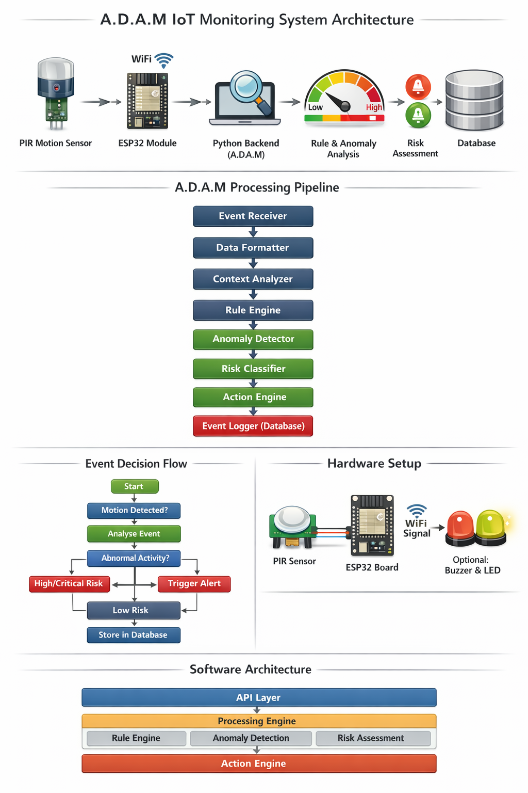
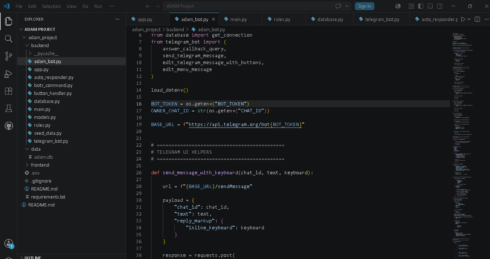
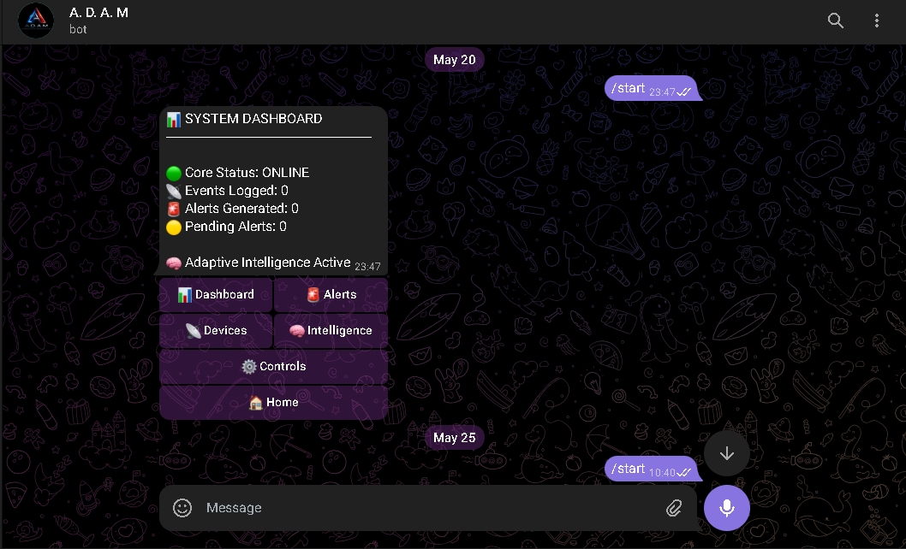
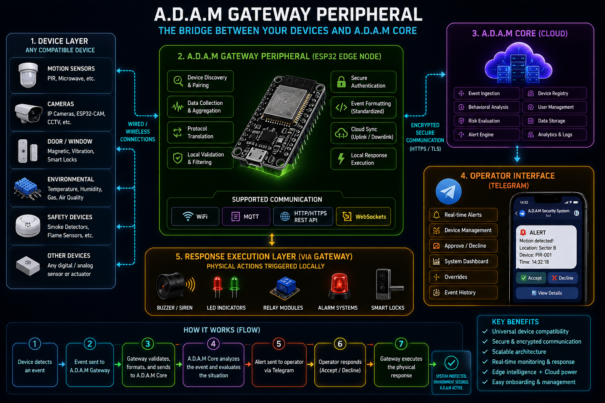

# A.D.A.M V1


> Autonomous Directive and Arbitration Machine
> Intelligent Monitoring • Adaptive Orchestration • Edge-Cloud Security Infrastructure

---

# Overview

A.D.A.M (Autonomous Directive and Arbitration Machine) is an experimental intelligent monitoring and orchestration framework designed to explore adaptive security systems, event-driven automation, behavioral analysis, and scalable IoT integration.

The project combines cloud intelligence, hardware communication, real-time event processing, and operator interaction into a modular architecture capable of evolving into a scalable monitoring ecosystem.

A.D.A.M is built around the philosophy that modern security systems should not only detect events, but also interpret context, evaluate behavioral patterns, and coordinate intelligent responses across connected environments.

---

# Core Features

* Real-time event monitoring
* Telegram operator interface
* Intelligent behavioral analysis
* Adaptive risk evaluation
* Event-driven response system
* Cloud-connected IoT architecture
* ESP32 gateway integration
* Device registration framework
* Alert routing and escalation
* Modular backend infrastructure
* Future-ready gateway ecosystem

---

# System Architecture



```plaintext
Sensors / Cameras
        │
        ▼
A.D.A.M Gateway Peripheral
(ESP32 Edge Node)
        │
        ▼
A.D.A.M Core Cloud Intelligence
 ├── Event Processing
 ├── Behavioral Analysis
 ├── Risk Evaluation
 ├── Alert Routing
 ├── Device Registry
 └── User Management
        │
        ▼
Telegram Operator Interface
        │
        ▼
Response Execution Layer
(Buzzer / Alarm / Relays)
```

---

# Architecture Philosophy

## Gateway Layer

The A.D.A.M Gateway Peripheral acts as the local edge node responsible for:

* collecting sensor data
* formatting structured events
* synchronizing with cloud infrastructure
* executing local responses
* maintaining communication between devices and the core system

---

## Cloud Intelligence Core

The A.D.A.M Core performs:

* contextual evaluation
* adaptive monitoring
* behavioral analysis
* risk assessment
* event orchestration
* intelligent alert routing

---

## Operator Interface Layer

Telegram serves as the operational interface for:

* real-time alerts
* approvals and overrides
* dashboard monitoring
* device onboarding
* response management
* security control operations

---

# Current Prototype Capabilities

The current prototype demonstrates:

* Motion detection using PIR sensors
* ESP32 hardware communication
* Cloud-based event ingestion
* Telegram alert routing
* Operator accept/decline response flow
* Physical response triggering using buzzers and output devices

---

# Project Structure

```plaintext
adam_project/
│
├── backend/
│   ├── app.py
│   ├── adam_bot.py
│   ├── telegram_bot.py
│   ├── auto_responder.py
│   ├── database.py
│   ├── models.py
│   ├── rules.py
│   └── seed_data.py
│
├── data/
│   └── adam.db
│
├── assets/
│   ├── banner.png
│   ├── architecture.png
│   ├── backend.png
│   ├── telegram.png
│   └── gateway.png
│
├── frontend/
│
├── requirements.txt
│
└── README.md
```

---

# Installation

Clone the repository:

```bash
git clone https://github.com/IrregDraken/A.D.A.M.V1.git
```

Move into the project directory:

```bash
cd A.D.A.M.V1
```

Install dependencies:

```bash
pip install -r requirements.txt
```

---

# Running A.D.A.M

Start the backend system:

```bash
python adam_project/backend/app.py
```

---

# Technologies Used

## Backend Infrastructure

* Python
* Flask
* SQLite

## Cloud & Deployment

* Render
* REST API Communication

## Hardware Layer

* ESP32
* PIR Motion Sensors
* Buzzers / Output Devices

## Operator Interface

* Telegram Bot API

---

# Screenshots

## Backend Runtime



---

## Telegram Operator Interface



---

# Hardware & Gateway Concept

## A.D.A.M Gateway Peripheral



The gateway peripheral acts as the bridge between physical devices and the A.D.A.M cloud intelligence core.

The architecture is designed to allow future support for:

* motion sensors
* CCTV systems
* environmental sensors
* smart locks
* smoke detectors
* additional IoT devices

through a unified onboarding and orchestration framework.

---

# Future Development Goals

* Persistent adaptive memory systems
* Universal sensor compatibility
* Smart gateway peripherals
* Multi-user infrastructure
* Secure device onboarding
* Web-based monitoring dashboard
* Distributed edge infrastructure
* Multi-site orchestration
* AI-assisted contextual analysis
* Advanced behavioral monitoring

---

# Vision

A.D.A.M is designed as the foundation for a scalable intelligent monitoring ecosystem capable of integrating cloud intelligence, edge hardware, adaptive orchestration, and real-time operator interaction into a unified platform.

The long-term vision is to create a modular security framework where compatible sensors, cameras, and response devices can integrate seamlessly into the A.D.A.M ecosystem through gateway-based orchestration and intelligent cloud coordination.

---

# Author

Developed by Ð R ƛ K E N 他
