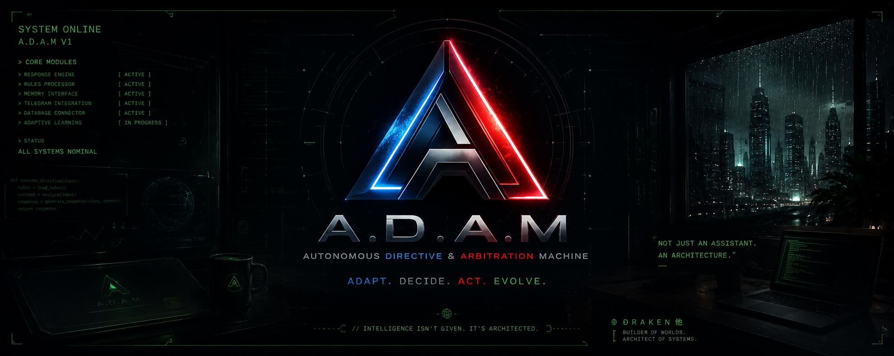

# A.D.A.M V1



> Experimental AI system exploring adaptive interaction, automation, memory systems, and modular intelligence architecture.

---

## Overview

A.D.A.M (Autonomous Directive and Arbitration Machine) is an AI-powered assistant framework designed to automate interactions, manage intelligent responses, and evolve through a modular backend architecture.

The project focuses on creating a scalable AI ecosystem capable of adaptive behavior, automation workflows, and future memory-driven systems.

---

## Features

* Automated response handling
* Telegram bot integration
* Rule-based interaction engine
* Database-backed storage
* Modular backend architecture
* Expandable AI system design
* Early-stage adaptive intelligence framework

---

## System Architecture

```plaintext
User
 │
 ▼
Telegram Interface
 │
 ▼
A.D.A.M Core Backend
 ├── Auto Response Engine
 ├── Rule Processing System
 ├── Database Layer
 └── Future Memory Modules
 │
 ▼
SQLite Database
```

---

## Project Structure

```plaintext
adam_project/
│
├── backend/
│   ├── app.py
│   ├── adam_bot.py
│   ├── telegram_bot.py
│   ├── auto_responder.py
│   ├── database.py
│   ├── models.py
│   └── rules.py
│
├── data/
│   └── adam.db
│
└── README.md
```

---

## Installation

Clone the repository:

```bash
git clone https://github.com/IrregDraken/A.D.A.M.V1.git
```

Move into the project directory:

```bash
cd A.D.A.M.V1
```

Install dependencies:

```bash
pip install -r requirements.txt
```

---

## Running A.D.A.M

Start the backend server:

```bash
python adam_project/backend/app.py
```

---

## Tech Stack

* Python
* Flask / FastAPI
* SQLite
* Telegram Bot API
* Render Deployment

---

## Future Goals

* Conversational intelligence expansion
* Persistent memory systems
* Adaptive personality modules
* AI-assisted automation workflows
* Web dashboard integration
* Device & gateway integration
* Scalable cloud infrastructure

---

## Screenshots

### Terminal / Backend


### Telegram Integration


### System Interface


---

## Vision

A.D.A.M represents the foundation of a larger evolving AI ecosystem focused on adaptive systems, intelligent automation, and future-facing human-AI interaction.

This project is being developed publicly as an evolving experimental architecture.

---

## Author

Developed by Ð R ƛ K E N 他
